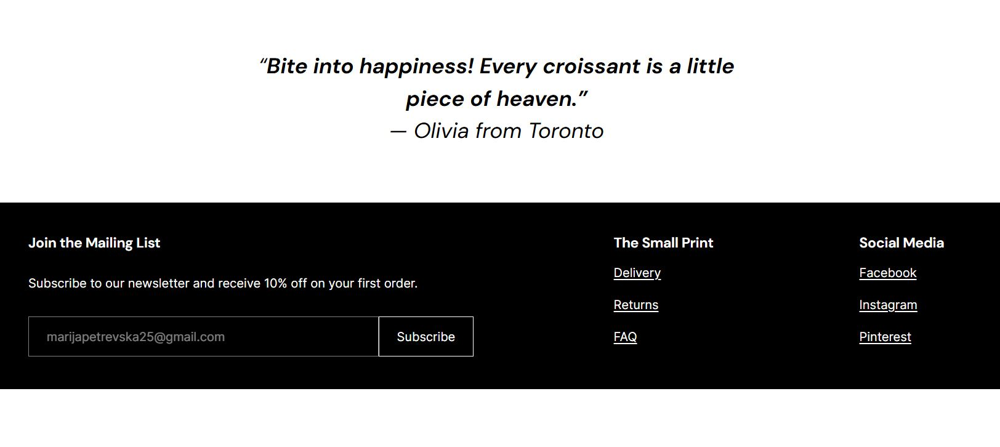

# WordPress Bakery Website 🍰🥐

## About this Project 
This is a WordPress bakery website created as a portfolio project.
  
This project was created after completing the **Guided Project: Build a Free Website with WordPress** on **Coursera**. After completing the course, I built my own bakery website project to apply what I learned, customize pages, and create a fully responsive layout.

## Features
- Home page
- About page
- Menu page (cakes, breads, pastries)
- Responsive design for mobile, tablet, and desktop
- Clean and user-friendly layout

## Tools & Technologies
- WordPress
- Elementor (page builder)
- HTML5
- CSS3
- Basic JavaScript

## Screenshots

